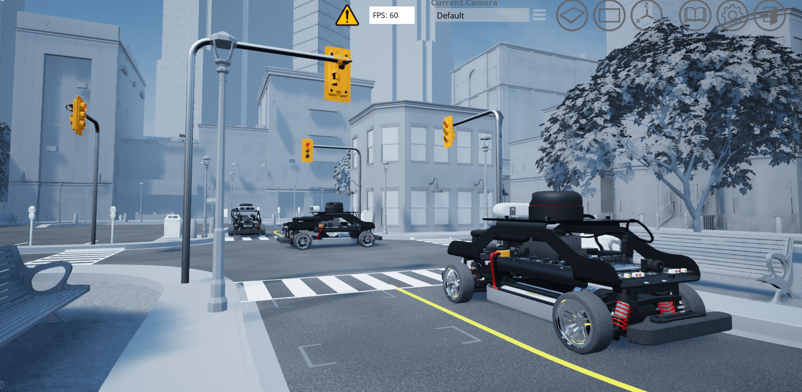
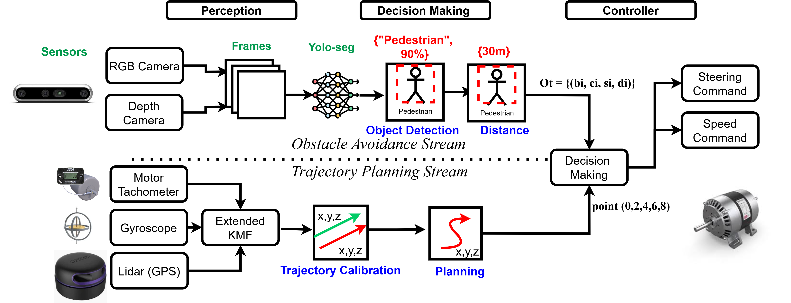
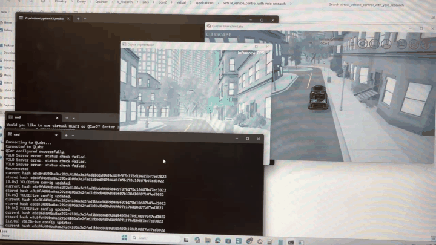

# Virtual Vehicle Control with YOLO Research

Code for a Quanser QCar / QLabs research setup that combines:

- virtual vehicle control,
- YOLO-based object perception,
- threshold-based decision logic for stop signs, traffic lights, vehicles, yield signs, and pedestrians,
- resilience-oriented experiments in autonomous driving.

This repository is intended as a public code companion for research on resilient autonomous vehicles and security-aware perception and control.

This code release is aligned with the published conference paper:

Tsai, Chieh, and Salim Hariri. "Intelligent Obstacle Resilience in Autonomous Vehicles Under Security Threats." 2025 IEEE 12th International Conference on Cyber Security and Cloud Computing (CSCloud). IEEE, 2025.
Video explanation: https://drive.google.com/file/d/1UJIRGdNgQHYSJj645q2r6ike3_ldHu72/view?usp=drive_link

## Preview





## Demo

The following GIF shows a short demo of the virtual vehicle control setup running with YOLO-based perception in QLabs.



## What Is Included

- `vehicle_control.py`: closed-loop vehicle controller for the QCar / QLabs setup
- `yolo_server.py`: perception server that runs YOLO and publishes object-distance signals
- `utils.py`: stream transport and drive-logic utilities
- `qlabs_setup.py`: QLabs environment setup script
- `config.json`: threshold configuration used by the drive logic
- `hacker.py`: simple config-modification script used for resilience experiments
- `YOLO/`: local YOLO helper modules used by the project

## System Context

This code depends on the Quanser software stack and QCar / QLabs APIs, including modules such as `pal`, `hal`, `qvl`, and `pit`. Those dependencies are not included in this repository.

This means the repository is best understood as:

- a research code release,
- a reference implementation for the method pipeline,
- and a reproducibility starting point for users with access to the required Quanser environment.

## Typical Workflow

1. Start the Quanser virtual environment / QLabs instance.
2. Launch the YOLO server:
   `python yolo_server.py`
3. Launch the vehicle controller:
   `python vehicle_control.py`
4. Adjust thresholds in `config.json` if needed for different scenarios.

## Configuration

The main runtime thresholds are stored in `config.json`.

Example fields:

- `stopSignThreshold`
- `trafficThreshold`
- `carThreshold`
- `yieldThreshold`
- `personThreshold`

The helper script `hacker.py` modifies these values to emulate threshold perturbations used in resilience-oriented tests.

## Notes for Reuse

- This repository does not bundle model weights or full dataset assets.
- The code is tied to the Quanser QCar / QLabs environment.
- If you reuse the structure, please document your environment and calibration settings.

## Related Papers

- Chieh Tsai and Salim Hariri. `Intelligent Obstacle Resilience in Autonomous Vehicles Under Security Threats`, 2025 IEEE 12th International Conference on Cyber Security and Cloud Computing (CSCloud), IEEE, 2025.
- Chieh Tsai, Hamed Rastgoftar, Salim Hariri. `RACF: A Resilient Autonomous Car Framework with Object Distance Correction`, arXiv:2604.12418.
- Chieh Tsai, Mohammad M. Abrar, Salim Hariri. `Security and Resilience in Autonomous Vehicles: A Proactive Design Approach`, arXiv:2604.12408.

## Citation

If this repository is useful in your research, please cite the published CSCloud 2025 paper:

```bibtex
@inproceedings{tsai2025intelligent,
  title={Intelligent Obstacle Resilience in Autonomous Vehicles Under Security Threats},
  author={Tsai, Chieh and Hariri, Salim},
  booktitle={2025 IEEE 12th International Conference on Cyber Security and Cloud Computing (CSCloud)},
  year={2025},
  publisher={IEEE}
}
```

You may also cite the newer follow-up framework paper when the broader resilient AV framework is the relevant contribution:

```bibtex
@article{tsai2026racf,
  title={RACF: A Resilient Autonomous Car Framework with Object Distance Correction},
  author={Tsai, Chieh and Rastgoftar, Hamed and Hariri, Salim},
  journal={arXiv preprint arXiv:2604.12418},
  year={2026}
}
```

## Author Links

- Google Scholar: https://scholar.google.com/citations?view_op=list_works&hl=en&hl=en&user=dWFu_R8AAAAJ&sortby=pubdate
- Research website: https://vegetableclean.github.io/

## Status

This repository has been prepared for public release, but you should still review:

- whether any environment-specific paths need cleanup,
- whether you want to rename `hacker.py` before publication,
- and whether you want to add a license before pushing to GitHub.
